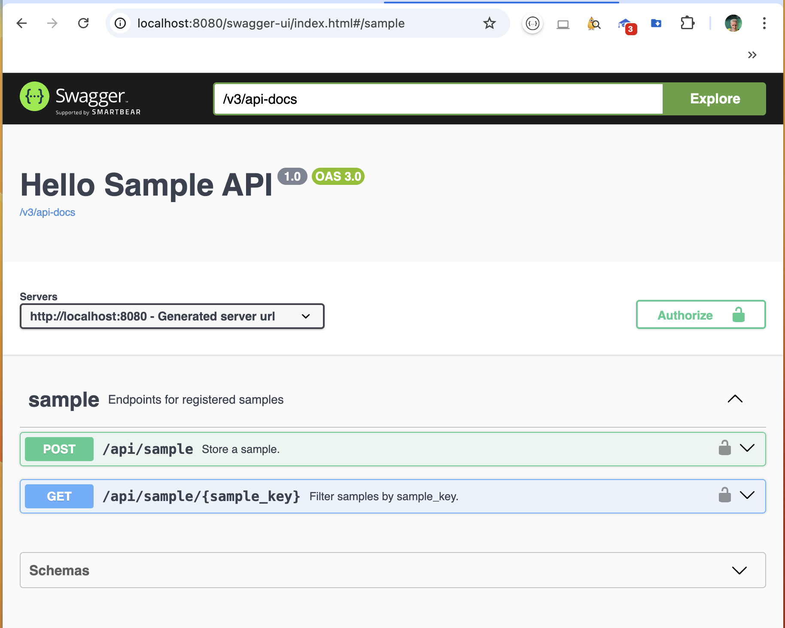
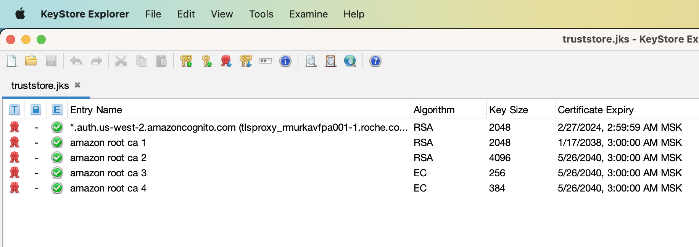

# hello spring-boot cognito



## API
example provided two API endpoints
```
GET /api/sample/{sample_key}
POST /api/sample
```
To access GET endpoint, a user should be authorized. The POST endpoint is protected by the following pre-authorization expression 

```java
  @PostMapping(value = "/api/sample")
  @PreAuthorize("hasRole(@environment.getProperty('app.roles.whitelist'))")
  public ResponseEntity<Sample> save(@RequestBody SampleRequest request) {
    return new ResponseEntity<>(svc.save(request), HttpStatus.CREATED);
  }
```

## Key Features

- Components
  - pure Spring Boot back-end application
  - there is no UI except Swagger UI
- Authentication
  - use OAuth JWT access tokens granted by Cognito Identity Provider
  - jwt tokens are not overridden in the app. it relies solely on Cognito tokens
  - end-users authenticated on the swagger-ui page only
  - service account uses the Cognito auth token endpoint directly
- Authorization
  - users and roles configured using application properties
  - service accounts can be easily registered in the system alongside regular end-users

### Authorization variants

Another possible authorization solutions are:
  - Database-backed user store. see JdbcOAuth2AuthorizedClientService 
  - Okta/Auth0 integrations
  - Keycloak
  - LDAP/Active Directory
  - Redis or Other Cache-based User Store
  - JAAS
  - Custom UserDetailsService
  - Spring Security ACL

## Getting Started

### prepare SSO

* generate app clients to use for SSO
* retrieve client secrets

### set environment variables
* rename default.env to .env and specify required environmental variables there:
    ```
    SERVER_PORT=
    REGION= 
    COGNITO_CLIENT=
    COGNITO_SECRET=  
    COGNITO_CLIENT_NAME=
    COGNITO_USER_POOL=
    COGNITO_AUTH_DOMAIN=
    TRUSTSTORE_PASSWORD=
    ```
  
### configure roles
To configure users and their roles, set additional environmental variables:
```
APP_ROLES_WHITELIST=ROLE_<user_group>
APP_USERS_<username without underscore>_GROUPS=<list of user groups separated by comma>
```
To register more users add additional `APP_USERS_` env variables. All user groups will be mapped to roles with the same names.

### start up
* start the application using docker compose
```bash
docker compose up --detach
```

### login
* open `http://localhost:8080/swagger-ui` url in the browser and authorize using Your SSO
* play a bit with GET and POST requests to verify how it is protected

## Trust store

Local jks truststore usage allows us to communicate with cognito domain with self-signed wildcarded certificate. It contains amazon root certificates as well:




